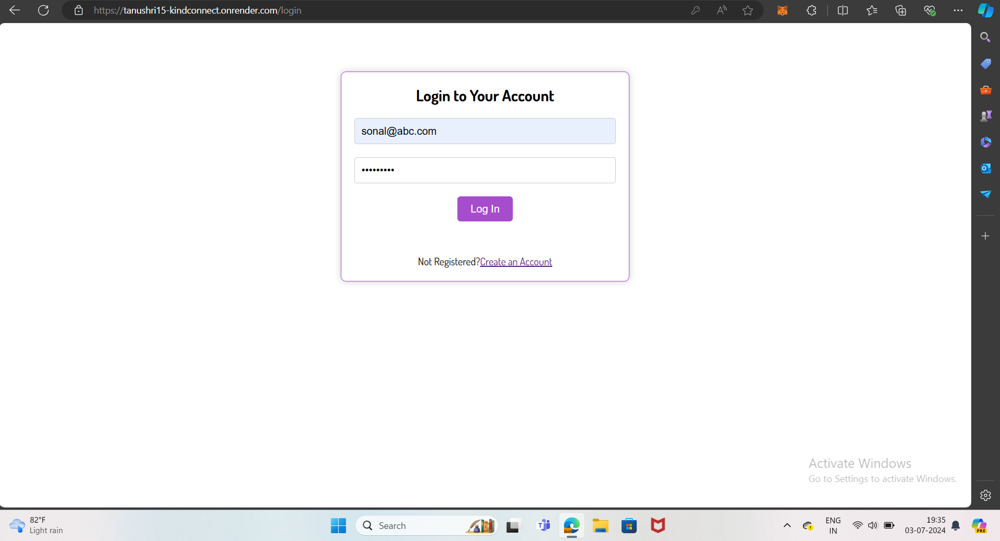
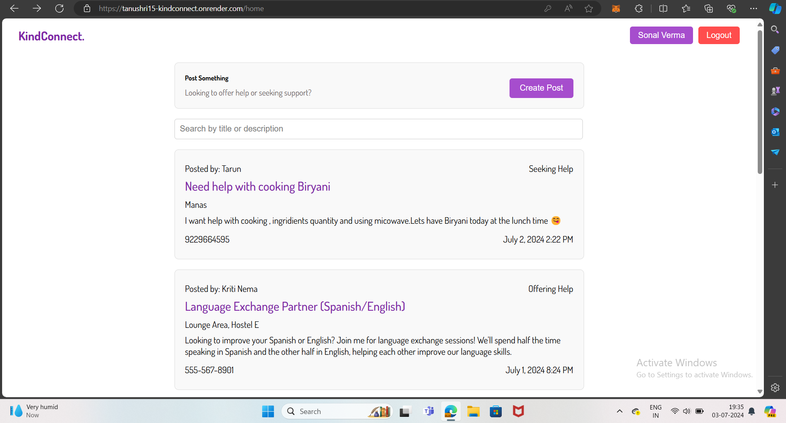
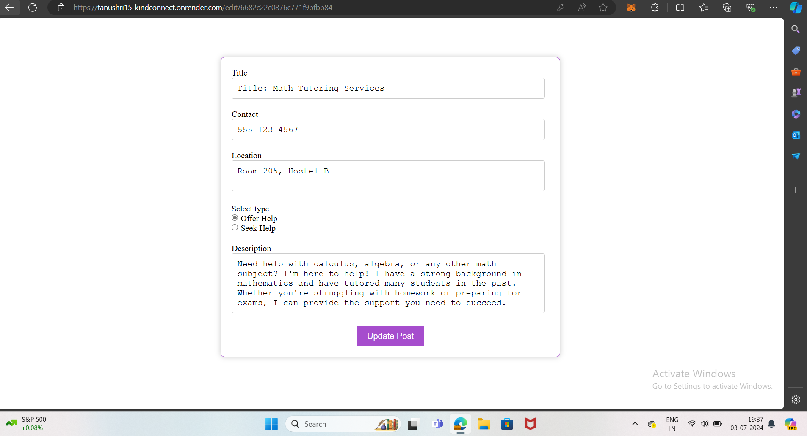
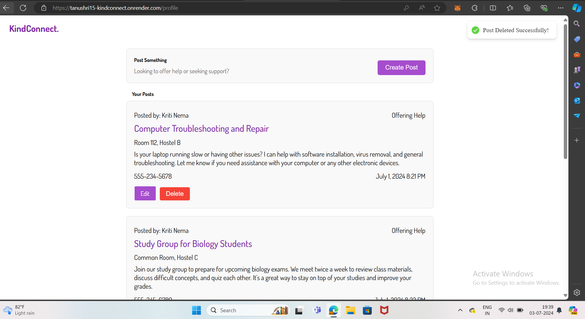

# KindConnect
KindConnect is a secure MERN web application designed to help users seek or offer assistance within their community. By fostering strong bonds and promoting mutual support, KindConnect provides a user-friendly platform where individuals can post their skills or needs, connect with others, and make meaningful contributions. With robust authentication and secure login features, users can confidently engage with the platform, knowing their information is protected. KindConnect aims to create a collaborative environment, encouraging a culture of helping and being helped, ultimately strengthening community ties.

## Screenshots
           
         
           
        

## Features

- **User Authentication:** Secure user registration and login using JWT and Bcrypt.
- **Post Creation:** Users can create posts to offer or seek assistance, including details such as title, description, contact information, and location.
- **Community Interaction:** Browse and search posts from other community members to find assistance or offer help.
- **Profile Management:** Users can manage their profiles, including updating personal information and viewing their posts.
- **Real-time Notifications:** Receive real-time notifications for new posts and responses.
- **Responsive Design:** User-friendly interface that works seamlessly on both desktop and mobile devices.
- **Robust Security:** Implements best practices for data security and user privacy.

## Technologies Used

- **MongoDB Atlas:** A cloud-based NoSQL database for scalable and flexible data storage.
- **React.js:** A JavaScript library for building dynamic and interactive user interfaces.
- **Express.js:** A minimalist web framework for Node.js, used to build backend services and APIs.
- **Node.js:** A JavaScript runtime environment that executes server-side code.
- **JWT (JSON Web Tokens):** A secure method for transmitting information between parties as a JSON object, used for authentication.
- **Bcrypt:** A library for hashing passwords to enhance security and protect user credentials.

#
